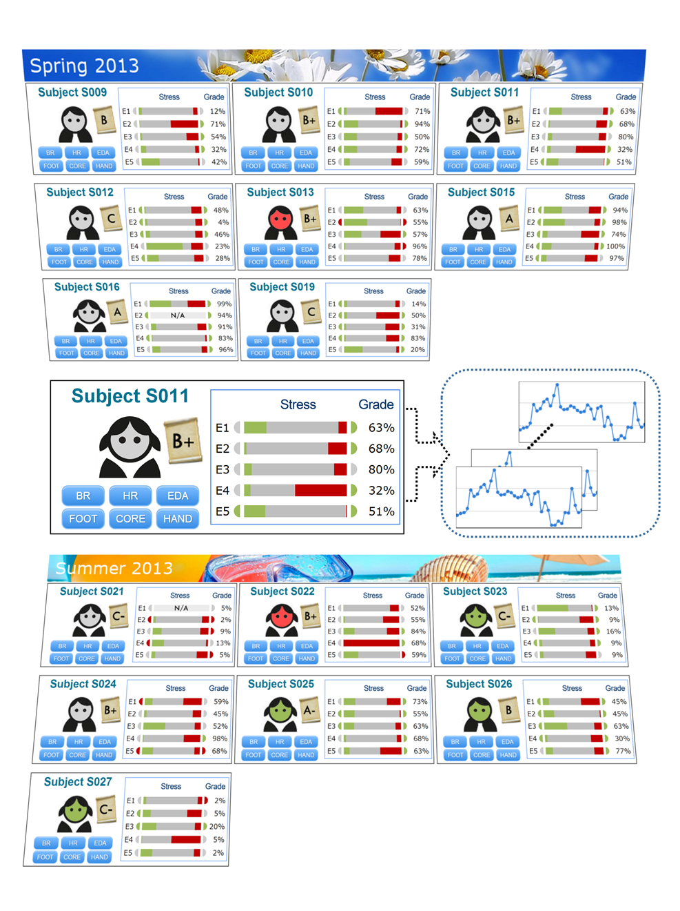

## <a href="http://kyeongan.cpl.uh.edu/projects/css/">User Portrait</a>
A data abstraction and visualization strategy named User Portrait that condensed the seeence of all the user information in a single view.

### Concept Diagram

### An example of Entire Signals

## Quick start
Few quick start options are available:
Download the latest release.

## What's included
Within the download you'll find the following directories and files, logically grouping common assets and providing both compiled and minified variations. You'll see something like this:

## Tested Enviorments
* Google Chrome
* Safari
* Internet Explorer 6+
* FireFox

## API Documentations
http://kyeongan.cpl.uh.edu/projects/css/api

## Examples
#####Exam Study: http://kyeongan.cpl.uh.edu/projects/css/
#####Childeren Study: http://kyeongan.cpl.uh.edu/projects/css/index_children.html

######more...
http://kyeongan.cpl.uh.edu/projects/css/api/generator-portrait.php?&hideButton=yes
http://kyeongan.cpl.uh.edu/projects/css/api/generator-portrait.php?subjects=10&cols=4&title=Happy%20Study%202015&exams=7&hideButton=yes
